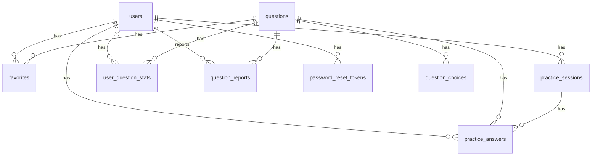

# DB設計

## 設計方針

* 要件定義をもとに、高等学校（情報）教員資格認定試験 科目Ⅰの学習支援サービスに必要なテーブルを定義する
* 複雑にしすぎないため、原則として第二正規化までの構成とする
* 第三正規化が必要になりそうな固定値は、DBテーブル化せず `utils` フォルダ内の配列で管理する
* 分野の追加・変更頻度は低い想定のため、分野マスタテーブルと分野管理画面は作成しない
* アカウント削除は物理削除とし、ユーザーに紐づく演習履歴・お気に入りも削除する

## DBで管理するもの

| 種別 | 管理方法 | 理由 |
| --- | --- | --- |
| ユーザー | DB | 会員登録、ログイン、アカウント削除が必要なため |
| 問題 | DB | 管理者が作成・編集・削除・公開状態変更を行うため |
| 選択肢 | DB | 問題ごとに4択を保持するため |
| お気に入り | DB | ユーザーごとに状態を保存するため |
| 演習履歴 | DB | ユーザーごとに演習回の結果を保存するため |
| 回答履歴 | DB | 問題ごとの正解・不正解を保存するため |
| 問題別進捗 | DB | 正解回数、不正解回数、連続正解数などを表示するため |
| 誤り報告 | DB | ユーザーからの報告と管理者の対応状態を管理するため |
| パスワード再設定 | DB | 再設定トークンと有効期限を管理するため |

## utilsで管理する固定値

以下は `utils` フォルダ内の配列で管理する。

配置:

* `frontend/app/utils/masterData.ts`
* `backend/app/utils/master_data.rb`

| 固定値 | 値 | 備考 |
| --- | --- | --- |
| ユーザー権限 | `user`, `admin` | 管理画面の表示制御に使用する |
| 大分類 | `teacher_education`, `information` | 表示上は `教職教養`, `情報科特有` とする |
| 小分類 | `education_history` など | 大分類との対応も `utils` で管理する |
| 難易度 | `star1`, `star2`, `star3` | 表示上は `★`, `★★`, `★★★` とする |
| 公開状態 | `draft`, `published`, `private` | 表示上は `下書き`, `公開`, `非公開` とする |
| 誤り報告対応状態 | `unhandled`, `in_progress`, `fixed`, `rejected` | 表示上は `未対応`, `対応中`, `修正済み`, `対応しない` とする |
| 演習種別 | `practice`, `mock_exam` | 通常演習と模擬試験を区別する |
| 出題条件 | `all`, `major_category`, `category` | 全分野、大分類指定、小分類指定を区別する |
| 追加条件 | `none`, `favorite`, `incorrect`, `unanswered` | お気に入り、間違えた問題、未回答問題などを区別する |
| メダル | `none`, `bronze`, `silver`, `gold` | 連続正解数から算出できるためDBには保存しない |
| 模擬試験の分野別出題数 | 小分類ごとの問題数 | 20問構成の内訳として使用する |

## ER図

## テーブル一覧

| テーブル名 | 概要 |
| --- | --- |
| `users` | ユーザー情報 |
| `questions` | 問題 |
| `question_choices` | 問題の選択肢 |
| `favorites` | お気に入り |
| `practice_sessions` | 演習回 |
| `practice_answers` | 演習回ごとの回答 |
| `user_question_stats` | ユーザーごとの問題別進捗 |
| `question_reports` | 問題の誤り報告 |
| `password_reset_tokens` | パスワード再設定トークン |

## users

ユーザー情報を管理する。

| カラム名 | 型 | NULL | 制約・補足 |
| --- | --- | --- | --- |
| `id` | bigint | NO | 主キー |
| `name` | string | NO | ユーザー名 |
| `email` | string | NO | 一意 |
| `password_digest` | string | NO | ハッシュ化したパスワード |
| `role` | string | NO | `user`, `admin`。初期値は `user` |
| `created_at` | datetime | NO | 作成日時 |
| `updated_at` | datetime | NO | 更新日時 |

### インデックス

| カラム | 種別 |
| --- | --- |
| `email` | unique |

### 補足

* パスワードは8文字以上とする
* アカウント削除時は物理削除する
* ユーザー削除時、以下をあわせて削除する
    * `favorites`
    * `practice_sessions`
    * `practice_answers`
    * `user_question_stats`
    * `question_reports`
    * `password_reset_tokens`

## questions

問題本文、解説、分類、難易度、公開状態を管理する。

分野はDBで正規化せず、`major_category_code` と `category_code` を文字列で保持する。表示名や選択肢は `utils` の配列から取得する。

| カラム名 | 型 | NULL | 制約・補足 |
| --- | --- | --- | --- |
| `id` | bigint | NO | 主キー |
| `major_category_code` | string | NO | 例: `teacher_education`, `information` |
| `category_code` | string | NO | 例: `education_law`, `algorithm` |
| `body` | text | NO | 問題文 |
| `explanation` | text | NO | 解答解説 |
| `difficulty` | string | NO | `star1`, `star2`, `star3` |
| `source_text` | text | YES | 参考にした出題範囲・根拠資料 |
| `publication_status` | string | NO | `draft`, `published`, `private` |
| `mock_exam_no` | integer | YES | 1〜60。模擬問題セット番号 |
| `mock_exam_question_no` | integer | YES | 1〜20。セット内の問題番号 |
| `created_by_user_id` | bigint | YES | 作成した管理者の `users.id` |
| `updated_by_user_id` | bigint | YES | 最終更新した管理者の `users.id` |
| `created_at` | datetime | NO | 作成日時 |
| `updated_at` | datetime | NO | 更新日時 |

### インデックス

| カラム | 種別 |
| --- | --- |
| `major_category_code` | normal |
| `category_code` | normal |
| `difficulty` | normal |
| `publication_status` | normal |
| `mock_exam_no, mock_exam_question_no` | unique |

### 補足

* 正答は `question_choices.is_correct` で管理する
* 4択問題のため、1つの問題に対して `question_choices` を4件登録する
* `major_category_code` と `category_code` は `utils` の分野配列に含まれる値のみ許可する
* 生成AIで作成した問題であることはサービス全体の前提として画面に表示する
* 60回分の模擬問題セットを扱うため、問題に `mock_exam_no` を持たせる

## question_choices

問題の選択肢を管理する。

| カラム名 | 型 | NULL | 制約・補足 |
| --- | --- | --- | --- |
| `id` | bigint | NO | 主キー |
| `question_id` | bigint | NO | `questions.id` |
| `choice_label` | string | NO | `ア`, `イ`, `ウ`, `エ` など |
| `body` | text | NO | 選択肢本文 |
| `is_correct` | boolean | NO | 正答かどうか |
| `display_order` | integer | NO | 表示順 |
| `created_at` | datetime | NO | 作成日時 |
| `updated_at` | datetime | NO | 更新日時 |

### インデックス

| カラム | 種別 |
| --- | --- |
| `question_id` | normal |
| `question_id, display_order` | unique |

### 補足

* 1問につき選択肢は4件とする
* 1問につき `is_correct = true` は1件のみとする

## favorites

ユーザーがお気に入り登録した問題を管理する。

| カラム名 | 型 | NULL | 制約・補足 |
| --- | --- | --- | --- |
| `id` | bigint | NO | 主キー |
| `user_id` | bigint | NO | `users.id` |
| `question_id` | bigint | NO | `questions.id` |
| `created_at` | datetime | NO | 作成日時 |
| `updated_at` | datetime | NO | 更新日時 |

### インデックス

| カラム | 種別 |
| --- | --- |
| `user_id, question_id` | unique |
| `question_id` | normal |

## practice_sessions

演習1回分の結果を管理する。

通常演習と模擬試験を同じテーブルで扱う。出題条件に使った分野コードは、履歴表示用にそのまま保存する。

| カラム名 | 型 | NULL | 制約・補足 |
| --- | --- | --- | --- |
| `id` | bigint | NO | 主キー |
| `user_id` | bigint | NO | `users.id` |
| `practice_type` | string | NO | `practice`, `mock_exam` |
| `condition_type` | string | NO | `all`, `major_category`, `category` |
| `major_category_code` | string | YES | 大分類指定時に使用 |
| `category_code` | string | YES | 小分類指定時に使用 |
| `extra_condition` | string | NO | `none`, `favorite`, `incorrect`, `unanswered` |
| `question_count` | integer | NO | 出題数 |
| `correct_count` | integer | NO | 正答数 |
| `correct_rate` | decimal | NO | 正答率 |
| `is_passed` | boolean | YES | 模擬試験の場合、12問以上正解で `true` |
| `started_at` | datetime | NO | 開始日時 |
| `finished_at` | datetime | YES | 終了日時 |
| `created_at` | datetime | NO | 作成日時 |
| `updated_at` | datetime | NO | 更新日時 |

### インデックス

| カラム | 種別 |
| --- | --- |
| `user_id` | normal |
| `practice_type` | normal |
| `finished_at` | normal |
| `major_category_code` | normal |
| `category_code` | normal |

### 補足

* 演習履歴一覧ではこのテーブルを主に参照する
* `correct_rate` は画面表示を簡単にするため保存する
* 模擬試験では `question_count = 20` とする
* 通常演習ではユーザーが指定した問題数を保存する

## practice_answers

演習回ごとの各問題の回答を管理する。

| カラム名 | 型 | NULL | 制約・補足 |
| --- | --- | --- | --- |
| `id` | bigint | NO | 主キー |
| `practice_session_id` | bigint | NO | `practice_sessions.id` |
| `user_id` | bigint | NO | `users.id` |
| `question_id` | bigint | NO | `questions.id` |
| `selected_choice_id` | bigint | YES | `question_choices.id`。未回答を許容する場合はNULL |
| `is_correct` | boolean | NO | 正解かどうか |
| `answered_at` | datetime | NO | 回答日時 |
| `created_at` | datetime | NO | 作成日時 |
| `updated_at` | datetime | NO | 更新日時 |

### インデックス

| カラム | 種別 |
| --- | --- |
| `practice_session_id` | normal |
| `user_id, question_id` | normal |
| `practice_session_id, question_id` | unique |
| `selected_choice_id` | normal |

### 補足

* 演習結果ページではこのテーブルを参照する
* 問題別進捗の集計元になる

## user_question_stats

ユーザーごとの問題別進捗を管理する。

回答のたびに `practice_answers` から再集計することもできるが、画面表示を簡単にするため集計結果を保存する。

| カラム名 | 型 | NULL | 制約・補足 |
| --- | --- | --- | --- |
| `id` | bigint | NO | 主キー |
| `user_id` | bigint | NO | `users.id` |
| `question_id` | bigint | NO | `questions.id` |
| `correct_count` | integer | NO | 正解回数 |
| `incorrect_count` | integer | NO | 不正解回数 |
| `consecutive_correct_count` | integer | NO | 連続正解数 |
| `last_answered_at` | datetime | YES | 最終回答日 |
| `created_at` | datetime | NO | 作成日時 |
| `updated_at` | datetime | NO | 更新日時 |

### インデックス

| カラム | 種別 |
| --- | --- |
| `user_id, question_id` | unique |
| `question_id` | normal |
| `last_answered_at` | normal |

### 補足

* メダルはDBに保存せず、`consecutive_correct_count` から算出する
* 1回正解で銅メダル、2回連続正解で銀メダル、3回連続正解で金メダルとする
* 不正解の場合、`consecutive_correct_count` は0に戻す

## question_reports

問題の誤り報告を管理する。

| カラム名 | 型 | NULL | 制約・補足 |
| --- | --- | --- | --- |
| `id` | bigint | NO | 主キー |
| `question_id` | bigint | NO | `questions.id` |
| `user_id` | bigint | YES | `users.id`。未ログイン報告を許可する場合はNULL |
| `report_body` | text | NO | 報告内容 |
| `status` | string | NO | `unhandled`, `in_progress`, `fixed`, `rejected` |
| `admin_memo` | text | YES | 管理者用メモ |
| `resolved_by_user_id` | bigint | YES | 対応した管理者の `users.id` |
| `resolved_at` | datetime | YES | 対応日時 |
| `created_at` | datetime | NO | 作成日時 |
| `updated_at` | datetime | NO | 更新日時 |

### インデックス

| カラム | 種別 |
| --- | --- |
| `question_id` | normal |
| `user_id` | normal |
| `status` | normal |
| `created_at` | normal |

### 補足

* 対応状態は `utils` の固定値として管理する
* 管理者は報告内容を確認し、必要に応じて問題を編集する

## password_reset_tokens

パスワード再設定用のトークンを管理する。

| カラム名 | 型 | NULL | 制約・補足 |
| --- | --- | --- | --- |
| `id` | bigint | NO | 主キー |
| `user_id` | bigint | NO | `users.id` |
| `token_digest` | string | NO | ハッシュ化した再設定トークン |
| `expires_at` | datetime | NO | 有効期限 |
| `used_at` | datetime | YES | 使用日時 |
| `created_at` | datetime | NO | 作成日時 |
| `updated_at` | datetime | NO | 更新日時 |

### インデックス

| カラム | 種別 |
| --- | --- |
| `token_digest` | unique |
| `user_id` | normal |
| `expires_at` | normal |

### 補足

* トークンそのものは保存せず、ハッシュ化して保存する
* 有効期限切れ、または `used_at` が入っているトークンは使用不可とする

## 主なリレーション

| 親 | 子 | 関係 |
| --- | --- | --- |
| `users` | `favorites` | 1対多 |
| `users` | `practice_sessions` | 1対多 |
| `users` | `practice_answers` | 1対多 |
| `users` | `user_question_stats` | 1対多 |
| `users` | `question_reports` | 1対多 |
| `questions` | `question_choices` | 1対多 |
| `questions` | `favorites` | 1対多 |
| `questions` | `practice_answers` | 1対多 |
| `questions` | `user_question_stats` | 1対多 |
| `questions` | `question_reports` | 1対多 |
| `practice_sessions` | `practice_answers` | 1対多 |

## 削除方針

| 対象 | 削除方針 |
| --- | --- |
| ユーザー | 物理削除 |
| ユーザーに紐づくお気に入り | ユーザー削除時に物理削除 |
| ユーザーに紐づく演習履歴 | ユーザー削除時に物理削除 |
| ユーザーに紐づく問題別進捗 | ユーザー削除時に物理削除 |
| 問題 | 管理者操作で物理削除。ただし履歴がある場合は `publication_status = private` を推奨 |
| 選択肢 | 問題削除時に物理削除 |
| 誤り報告 | 問題削除時に物理削除 |

## バリデーション

| 対象 | 内容 |
| --- | --- |
| `users.email` | 必須、一意 |
| `users.password` | 8文字以上 |
| `questions.major_category_code` | `utils` の大分類に含まれる値のみ |
| `questions.category_code` | `utils` の小分類に含まれる値のみ |
| `questions.body` | 必須 |
| `questions.explanation` | 必須 |
| `questions.difficulty` | `utils` の難易度に含まれる値のみ |
| `questions.publication_status` | `utils` の公開状態に含まれる値のみ |
| `question_choices` | 1問につき4件 |
| `question_choices.is_correct` | 1問につき1件のみ `true` |
| `practice_sessions.condition_type` | `utils` の出題条件に含まれる値のみ |
| `practice_sessions.major_category_code` | 大分類指定時は必須 |
| `practice_sessions.category_code` | 小分類指定時は必須 |
| `practice_sessions.question_count` | 1以上 |
| `practice_sessions.correct_count` | `question_count` 以下 |
| `question_reports.report_body` | 必須 |
| `question_reports.status` | `utils` の誤り報告対応状態に含まれる値のみ |

## 実装時の補足

* Rails API側では `dependent: :destroy` を使い、ユーザー削除時に関連データを削除する
* 固定値はDBに入れず、`utils` の配列をフロントエンドの表示とバックエンドのバリデーションで共有しやすい形にする
* 分野は `utils` で管理し、DBには分類コードだけを保存する
* 分野名を変更した場合、過去の問題や演習履歴の表示名も新しい表示名に変わる
* 年1回程度の分野追加・変更であれば、`utils` の配列を修正してデプロイする運用で十分とする
* まずはこの構成で実装し、分野変更が頻繁になった場合のみ分野マスタテーブル化を検討する
