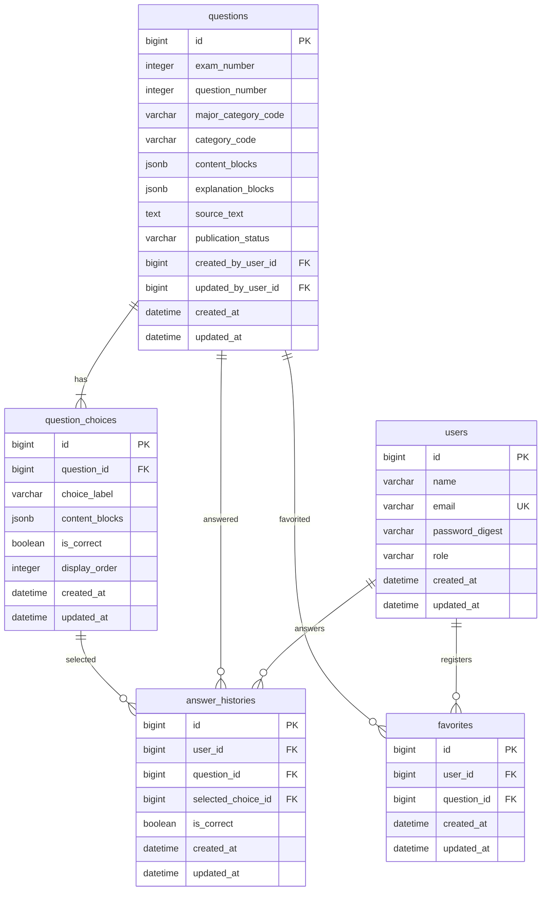

# DB設計

## 1. 概要

教員資格認定試験（高等学校・情報）の問題演習サービスで使用するDBを定義する。

本設計では、問題を1問ずつ解くシンプルな演習を前提とする。問題は試験ナンバーごとに20問を配置するが、受験セッションや試験結果は管理しない。未ログイン時の解答は保存せず、ログインユーザーについてのみ解答履歴とお気に入りを保存する。

### 対象テーブル

| テーブル | 用途 |
|---|---|
| `users` | ユーザー・管理者アカウント |
| `questions` | 問題本文、分類、解説、公開状態 |
| `question_choices` | 問題の選択肢と正解情報 |
| `answer_histories` | ログインユーザーの解答履歴 |
| `favorites` | ログインユーザーのお気に入り |

次の機能に対応するテーブルは設けない。

- 演習セッション
- 模擬試験の受験セッション・試験結果
- 学習進捗・分野別集計・メダル
- 問題の誤り報告
- パスワード再設定

## 2. ER図


```mermaid
erDiagram
    users ||--o{ answer_histories : answers
    users ||--o{ favorites : registers
    questions ||--|{ question_choices : has
    questions ||--o{ answer_histories : answered
    questions ||--o{ favorites : favorited
    question_choices ||--o{ answer_histories : selected

    users {
        bigint id PK
        varchar name
        varchar email UK
        varchar password_digest
        varchar role
        datetime created_at
        datetime updated_at
    }

    questions {
        bigint id PK
        integer exam_number
        integer question_number
        varchar major_category_code
        varchar category_code
        jsonb content_blocks
        jsonb explanation_blocks
        text source_text
        varchar publication_status
        bigint created_by_user_id FK
        bigint updated_by_user_id FK
        datetime created_at
        datetime updated_at
    }

    question_choices {
        bigint id PK
        bigint question_id FK
        varchar choice_label
        jsonb content_blocks
        boolean is_correct
        integer display_order
        datetime created_at
        datetime updated_at
    }

    answer_histories {
        bigint id PK
        bigint user_id FK
        bigint question_id FK
        bigint selected_choice_id FK
        boolean is_correct
        datetime created_at
        datetime updated_at
    }

    favorites {
        bigint id PK
        bigint user_id FK
        bigint question_id FK
        datetime created_at
        datetime updated_at
    }
```

## 3. テーブル定義

### 3.1 users

ユーザーと管理者のアカウントを管理する。

| カラム | 型 | NULL | デフォルト | 制約・説明 |
|---|---|---:|---|---|
| `id` | BIGINT | NO | - | 主キー |
| `name` | VARCHAR(100) | NO | - | 表示名 |
| `email` | VARCHAR(255) | NO | - | ログイン用メールアドレス。小文字に正規化して保存 |
| `password_digest` | VARCHAR(255) | NO | - | ハッシュ化済みパスワード |
| `role` | VARCHAR(20) | NO | `user` | `user` または `admin` |
| `created_at` | DATETIME | NO | 現在時刻 | 作成日時 |
| `updated_at` | DATETIME | NO | 現在時刻 | 更新日時 |

#### インデックス・制約

| 種別 | 対象 | 内容 |
|---|---|---|
| PRIMARY KEY | `id` | 主キー |
| UNIQUE INDEX | `email` | メールアドレスの重複を禁止 |
| CHECK | `role` | `user`, `admin` のみ許可 |

#### 補足

- パスワードは平文で保存しない。
- メールアドレスは登録・更新時に前後の空白を除去し、小文字へ正規化する。
- アカウント削除時は、そのユーザーの `answer_histories` と `favorites` を削除する。

### 3.2 questions

試験ナンバーごとに20問を配置し、問題本文、分類、解説、出典、公開状態を管理する。問題本文と解説は、文章、引用、表、プログラムなどを表示順に並べられるコンテンツブロックとして保存する。

| カラム | 型 | NULL | デフォルト | 制約・説明 |
|---|---|---:|---|---|
| `id` | BIGINT | NO | - | 主キー |
| `exam_number` | INTEGER | NO | - | 問題が属する試験ナンバー。1以上 |
| `question_number` | INTEGER | NO | - | 試験セット内の問番号。1〜20 |
| `major_category_code` | VARCHAR(50) | NO | - | 大分類コード |
| `category_code` | VARCHAR(100) | NO | - | 分野コード |
| `content_blocks` | JSONB | NO | - | 問題文の表示ブロック。通常文、引用文、表、プログラム、プログラム比較を表示順に保持 |
| `explanation_blocks` | JSONB | NO | - | 解答後に表示する解説の表示ブロック |
| `source_text` | TEXT | YES | `NULL` | 出典・根拠資料 |
| `publication_status` | VARCHAR(20) | NO | `draft` | 公開状態 |
| `created_by_user_id` | BIGINT | YES | `NULL` | 作成した管理者。`users.id` を参照 |
| `updated_by_user_id` | BIGINT | YES | `NULL` | 最終更新した管理者。`users.id` を参照 |
| `created_at` | DATETIME | NO | 現在時刻 | 作成日時 |
| `updated_at` | DATETIME | NO | 現在時刻 | 更新日時 |

#### インデックス・制約

| 種別 | 対象 | 内容 |
|---|---|---|
| PRIMARY KEY | `id` | 主キー |
| UNIQUE INDEX | `exam_number, question_number` | 同じ試験ナンバー内の問番号重複を禁止 |
| INDEX | `exam_number, publication_status, question_number` | 試験セットの公開問題を問番号順に取得 |
| INDEX | `major_category_code` | 大分類での抽出 |
| INDEX | `category_code` | 分野での抽出 |
| INDEX | `publication_status, id` | 公開問題の取得 |
| FOREIGN KEY | `created_by_user_id` | `users.id`。管理者削除時は `NULL` |
| FOREIGN KEY | `updated_by_user_id` | `users.id`。管理者削除時は `NULL` |
| CHECK | `exam_number` | 1以上 |
| CHECK | `question_number` | 1〜20 |
| CHECK | 各コード・状態 | 「4. 固定値」の値のみ許可 |

#### 補足

- 一般ユーザーには `publication_status = published` の問題だけを表示する。
- `exam_number` は1以上、`question_number` は1〜20とする。
- 1つの試験ナンバーを試験セットとして扱い、試験セットとして提供する際は問1〜20が各1件ずつ存在することをアプリケーションで検証する。
- 問題削除時は、関連する選択肢、解答履歴、お気に入りも同一トランザクションで削除する。
- 解答前の一般向けAPIでは、解説や正解情報を返さない。
- `content_blocks` と `explanation_blocks` は配列とし、配列の並び順をそのまま画面の表示順とする。
- 問題本文の `content_blocks` では `text`, `quote`, `table`, `code`, `code_group` を使用できる。
- 解説の `explanation_blocks` では `text`, `quote`, `table`, `code` を使用できる。
- コンテンツブロックの構造は「4.5 コンテンツブロック形式」に従い、問題の作成・更新時にアプリケーションで検証する。

### 3.3 question_choices

問題ごとの選択肢を管理する。

| カラム | 型 | NULL | デフォルト | 制約・説明 |
|---|---|---:|---|---|
| `id` | BIGINT | NO | - | 主キー |
| `question_id` | BIGINT | NO | - | `questions.id` を参照 |
| `choice_label` | VARCHAR(10) | NO | - | 画面表示用ラベル。例: `ア`, `イ`, `ウ`, `エ` |
| `content_blocks` | JSONB | NO | - | 選択肢の表示ブロック。通常文または表形式の内容を保持 |
| `is_correct` | BOOLEAN | NO | `false` | 正解なら `true` |
| `display_order` | INTEGER | NO | - | 表示順 |
| `created_at` | DATETIME | NO | 現在時刻 | 作成日時 |
| `updated_at` | DATETIME | NO | 現在時刻 | 更新日時 |

#### インデックス・制約

| 種別 | 対象 | 内容 |
|---|---|---|
| PRIMARY KEY | `id` | 主キー |
| FOREIGN KEY | `question_id` | `questions.id`。問題削除時に削除 |
| UNIQUE INDEX | `question_id, choice_label` | 同一問題内のラベル重複を禁止 |
| UNIQUE INDEX | `question_id, display_order` | 同一問題内の表示順重複を禁止 |
| PARTIAL UNIQUE INDEX | `question_id WHERE is_correct = true` | 1問につき正解を最大1件に制限 |

#### 補足

- 1問につき選択肢4件、正解1件を必須とする。
- 選択肢数と正解数は、問題の作成・更新トランザクション内でアプリケーションが検証する。
- 解答履歴から参照されている選択肢は個別削除せず、必要な修正は同じIDのまま更新する。
- `content_blocks` では `text` と `table` を使用できる。表形式でも選択肢1件を1つの回答対象として扱う。
- `content_blocks` の配列順を表示順とし、構造は「4.5 コンテンツブロック形式」に従う。

### 3.4 answer_histories

ログインユーザーが解答した内容を1回答につき1件保存する。未ログインユーザーの回答は保存しない。

| カラム | 型 | NULL | デフォルト | 制約・説明 |
|---|---|---:|---|---|
| `id` | BIGINT | NO | - | 主キー |
| `user_id` | BIGINT | NO | - | `users.id` を参照 |
| `question_id` | BIGINT | NO | - | `questions.id` を参照 |
| `selected_choice_id` | BIGINT | NO | - | 選択した `question_choices.id` |
| `is_correct` | BOOLEAN | NO | - | 解答時点の正誤 |
| `created_at` | DATETIME | NO | 現在時刻 | 解答日時。APIでは `answered_at` として扱う |
| `updated_at` | DATETIME | NO | 現在時刻 | 更新日時 |

#### インデックス・制約

| 種別 | 対象 | 内容 |
|---|---|---|
| PRIMARY KEY | `id` | 主キー |
| FOREIGN KEY | `user_id` | `users.id`。ユーザー削除時に削除 |
| FOREIGN KEY | `question_id` | `questions.id`。問題削除時に削除 |
| FOREIGN KEY | `selected_choice_id` | `question_choices.id` |
| INDEX | `user_id, created_at` | ユーザー別の履歴を新しい順に取得 |
| INDEX | `user_id, question_id` | 問題ごとの解答有無・履歴を確認 |
| INDEX | `question_id` | 問題単位の参照・削除 |
| INDEX | `selected_choice_id` | 選択肢参照の確認 |

#### 補足

- 同じユーザーが同じ問題へ複数回解答することを許可する。
- `selected_choice_id` が同じ `question_id` に属することを、保存時に検証する。
- `is_correct` は解答時点の判定結果を保持するスナップショットとする。
- 履歴一覧は `created_at DESC, id DESC` で安定して並べる。

### 3.5 favorites

ログインユーザーがお気に入り登録した問題を管理する。

| カラム | 型 | NULL | デフォルト | 制約・説明 |
|---|---|---:|---|---|
| `id` | BIGINT | NO | - | 主キー |
| `user_id` | BIGINT | NO | - | `users.id` を参照 |
| `question_id` | BIGINT | NO | - | `questions.id` を参照 |
| `created_at` | DATETIME | NO | 現在時刻 | 登録日時 |
| `updated_at` | DATETIME | NO | 現在時刻 | 更新日時 |

#### インデックス・制約

| 種別 | 対象 | 内容 |
|---|---|---|
| PRIMARY KEY | `id` | 主キー |
| FOREIGN KEY | `user_id` | `users.id`。ユーザー削除時に削除 |
| FOREIGN KEY | `question_id` | `questions.id`。問題削除時に削除 |
| UNIQUE INDEX | `user_id, question_id` | 同一問題の重複登録を禁止 |
| INDEX | `user_id, created_at` | ユーザー別のお気に入り一覧取得 |
| INDEX | `question_id` | 問題単位の参照・削除 |

#### 補足

- お気に入り登録は、対象問題が公開中であれば回答履歴の有無にかかわらず許可する。
- お気に入り登録APIは冪等とし、登録済みの場合も同じレコードを返す。

## 4. 固定値

### 4.1 ユーザーロール

| 値 | 表示名 |
|---|---|
| `user` | 一般ユーザー |
| `admin` | 管理者 |

### 4.2 大分類

| 値 | 表示名 |
|---|---|
| `teacher_education` | 教職教養 |
| `information` | 情報科特有 |

### 4.3 分野

| 値 | 大分類 | 表示名 |
|---|---|---|
| `education_history` | `teacher_education` | 教育史 |
| `education_law` | `teacher_education` | 教育法規 |
| `curriculum_guideline` | `teacher_education` | 学習指導要領 |
| `student_guidance` | `teacher_education` | 生徒指導提要 |
| `educational_psychology` | `teacher_education` | 教育心理 |
| `new_japanese_school_education` | `teacher_education` | 令和の日本型学校教育 |
| `information_curriculum_guideline` | `information` | 学習指導要領（情報） |
| `algorithm` | `information` | アルゴリズム |
| `data_science` | `information` | データサイエンス |

### 4.4 公開状態

| 値 | 表示名 | 一般公開 |
|---|---|---:|
| `draft` | 下書き | しない |
| `published` | 公開 | する |
| `private` | 非公開 | しない |

### 4.5 コンテンツブロック形式

問題本文、選択肢、解説は、次の形式のオブジェクトを配列で保持する。HTMLは保存せず、フロントエンドが `type` に応じた部品で描画する。

| `type` | 用途 | 主なデータ |
|---|---|---|
| `text` | 通常の文章 | `text` |
| `quote` | 枠付きの引用文 | `text`, 任意の `source` |
| `table` | 表 | `headers`, `rows` |
| `code` | 単独のプログラム表記 | 任意の `title`, `code` |
| `code_group` | 複数プログラムの比較 | `items`。各要素に `title`, `code` |

問題本文の例:

```json
[
  {
    "type": "text",
    "text": "次のプログラムAとプログラムBについて答えなさい。"
  },
  {
    "type": "code_group",
    "items": [
      {
        "title": "プログラムA",
        "code": "(01) i = 0\n(02) i < n - 1 の間繰り返す:"
      },
      {
        "title": "プログラムB",
        "code": "(01) i = 1\n(02) i < n の間繰り返す:"
      }
    ]
  }
]
```

表ブロックの例:

```json
{
  "type": "table",
  "headers": ["第1層", "第2層", "第3層", "第4層"],
  "rows": [
    ["内容1", "内容2", "内容3", "内容4"]
  ]
}
```

#### 検証ルール

- 配列は1件以上とし、各ブロックに許可された `type` と必須データがあることを検証する。
- `text`, `source`, `title`, `code` は文字列とし、空文字だけの値を許可しない。
- `table.headers` と各 `table.rows` の列数を一致させる。
- `code` と `code_group.items[].code` は改行と字下げを変更せず保存する。
- `code_group.items` は2件以上とする。
- 令和7年度科目Ⅰを基準とする初期設計では、画像ブロックは設けない。

## 5. 整合性ルール

### 5.1 問題登録・更新

問題と選択肢は同一トランザクションで保存し、次をすべて満たす場合だけ確定する。

- 大分類と分野の組み合わせが「4. 固定値」と一致する。
- 試験ナンバーが1以上で、問番号が1〜20の範囲にある。
- 試験ナンバーと問番号の組み合わせが重複しない。
- 選択肢が4件ある。
- 正解の選択肢が1件だけある。
- `choice_label` と `display_order` が問題内で重複しない。
- 問題本文、選択肢、解説のコンテンツブロックが「4.5 コンテンツブロック形式」に従う。

### 5.2 解答保存

- 認証済みユーザーの解答だけを保存する。
- 選択した選択肢が対象問題に属することを確認する。
- 正誤は選択肢の `is_correct` からサーバー側で判定する。
- 解答履歴の保存とレスポンス生成は同じ判定結果を使用する。

### 5.3 削除方針

| 削除対象 | 関連データの扱い |
|---|---|
| 一般ユーザー | 解答履歴、お気に入りを削除 |
| 管理者ユーザー | 作成者・更新者参照を `NULL` にする |
| 問題 | 解答履歴、お気に入り、選択肢を同一トランザクションで削除 |
| 選択肢 | 問題単位の削除を原則とし、履歴参照中の個別削除は許可しない |

## 6. セキュリティ・運用

- パスワードには十分な強度のハッシュ関数を使用する。
- APIレスポンスへ `password_digest` を含めない。
- 管理者権限の判定は `users.role` をサーバー側で確認する。
- DBバックアップにはユーザー情報が含まれるため、保存先と閲覧権限を制限する。
- 解答履歴とお気に入りは本人または管理者以外から参照できないようにする。

## 7. APIとの対応

| API上の資源 | 主なテーブル |
|---|---|
| アカウント登録・ログイン・本人情報 | `users` |
| 問題取得・問題管理 | `questions`, `question_choices` |
| 解答判定 | `questions`, `question_choices` |
| ログイン時の解答保存・履歴 | `answer_histories` |
| お気に入り | `favorites` |

未ログイン時の解答判定はリクエスト内の選択肢を使って行い、DBには履歴を追加しない。
