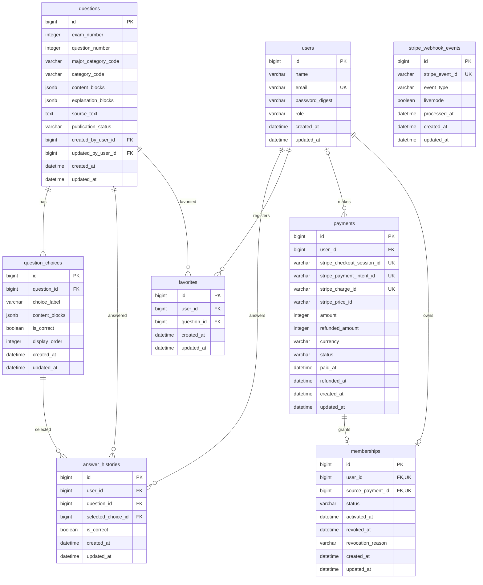

# DB設計

## 1. 概要

教員資格認定試験（高等学校・情報）の問題演習サービスで使用するDBを定義する。

本設計では、問題を1問ずつ解くシンプルな演習を前提とする。問題は試験ナンバーごとに20問を配置するが、受験セッションや試験結果は管理しない。未ログイン時の解答は保存せず、ログインユーザーについてのみ解答履歴とお気に入りを保存する。模擬試験1〜5は無料、模擬試験6以降は500円の買い切りを完了した有料会員向けとし、決済と利用資格をStripeの識別子により管理する。

### 対象テーブル

| テーブル | 用途 |
|---|---|
| `users` | ユーザー・管理者アカウント |
| `questions` | 問題本文、分類、解説、公開状態 |
| `question_choices` | 問題の選択肢と正解情報 |
| `answer_histories` | ログインユーザーの解答履歴 |
| `favorites` | ログインユーザーのお気に入り |
| `payments` | Stripe Checkoutによる決済と返金・異議申立て状態 |
| `memberships` | ユーザーの有料コンテンツ利用資格 |
| `stripe_webhook_events` | 処理済みStripe Event IDを保持する冪等性記録 |
| `question_seed_states` | seedの前回内容と公開状態、管理画面での削除を保持する同期記録 |

### seed同期記録

`question_seed_states` は `exam_number` と `question_number` の組に一意制約を持つ。`seed_digest` は直前に確認したseedの内容ハッシュ、`seed_publication_status` はseed側の公開状態、`deleted` は削除による同期停止フラグである。作成・更新日時を記録する。問題削除後も残す必要があるため `questions` の削除に連動する外部キーは設けない。ハッシュの比較対象は本文・選択肢と正答・解説・出典・分類・問題番号で、公開状態を分離する。

次の機能に対応するテーブルは設けない。

- 演習セッション
- 模擬試験の受験セッション・試験結果
- 学習進捗・分野別集計・メダル
- 問題の誤り報告
- パスワード再設定

## 2. ER図


```mermaid
erDiagram
    users ||--o{ answer_histories : answers
    users ||--o{ favorites : registers
    users o|--o{ payments : makes
    users ||--o| memberships : owns
    payments ||--o| memberships : grants
    questions ||--|{ question_choices : has
    questions ||--o{ answer_histories : answered
    questions ||--o{ favorites : favorited
    question_choices ||--o{ answer_histories : selected

    users {
        bigint id PK
        varchar name
        varchar email UK
        varchar password_digest
        varchar role
        datetime created_at
        datetime updated_at
    }

    questions {
        bigint id PK
        integer exam_number
        integer question_number
        varchar major_category_code
        varchar category_code
        jsonb content_blocks
        jsonb explanation_blocks
        text source_text
        varchar publication_status
        bigint created_by_user_id FK
        bigint updated_by_user_id FK
        datetime created_at
        datetime updated_at
    }

    question_choices {
        bigint id PK
        bigint question_id FK
        varchar choice_label
        jsonb content_blocks
        boolean is_correct
        integer display_order
        datetime created_at
        datetime updated_at
    }

    answer_histories {
        bigint id PK
        bigint user_id FK
        bigint question_id FK
        bigint selected_choice_id FK
        boolean is_correct
        datetime created_at
        datetime updated_at
    }

    favorites {
        bigint id PK
        bigint user_id FK
        bigint question_id FK
        datetime created_at
        datetime updated_at
    }

    payments {
        bigint id PK
        bigint user_id FK
        varchar stripe_checkout_session_id UK
        varchar stripe_payment_intent_id UK
        varchar stripe_charge_id UK
        varchar stripe_price_id
        integer amount
        integer refunded_amount
        varchar currency
        varchar status
        datetime paid_at
        datetime refunded_at
        datetime created_at
        datetime updated_at
    }

    memberships {
        bigint id PK
        bigint user_id FK,UK
        bigint source_payment_id FK,UK
        varchar status
        datetime activated_at
        datetime revoked_at
        varchar revocation_reason
        datetime created_at
        datetime updated_at
    }

    stripe_webhook_events {
        bigint id PK
        varchar stripe_event_id UK
        varchar event_type
        boolean livemode
        datetime processed_at
        datetime created_at
        datetime updated_at
    }
```

## 3. テーブル定義

### 3.1 users

ユーザーと管理者のアカウントを管理する。

| カラム | 型 | NULL | デフォルト | 制約・説明 |
|---|---|---:|---|---|
| `id` | BIGINT | NO | - | 主キー |
| `name` | VARCHAR(100) | NO | - | 表示名 |
| `email` | VARCHAR(255) | NO | - | ログイン用メールアドレス。小文字に正規化して保存 |
| `password_digest` | VARCHAR(255) | NO | - | ハッシュ化済みパスワード |
| `role` | VARCHAR(20) | NO | `user` | `user` または `admin` |
| `created_at` | DATETIME | NO | 現在時刻 | 作成日時 |
| `updated_at` | DATETIME | NO | 現在時刻 | 更新日時 |

#### インデックス・制約

| 種別 | 対象 | 内容 |
|---|---|---|
| PRIMARY KEY | `id` | 主キー |
| UNIQUE INDEX | `email` | メールアドレスの重複を禁止 |
| CHECK | `role` | `user`, `admin` のみ許可 |

#### 補足

- パスワードは平文で保存しない。
- メールアドレスは登録・更新時に前後の空白を除去し、小文字へ正規化する。
- 有料会員資格は `role` で表さず、`memberships` で管理する。管理者権限と購入状態を混在させない。
- アカウント削除時は、そのユーザーの `answer_histories`、`favorites`、`memberships` を削除し、`payments.user_id` は `NULL` にする。

### 3.2 questions

試験ナンバーごとに20問を配置し、問題本文、分類、解説、出典、公開状態を管理する。問題本文と解説は、文章、引用、表、プログラムなどを表示順に並べられるコンテンツブロックとして保存する。

| カラム | 型 | NULL | デフォルト | 制約・説明 |
|---|---|---:|---|---|
| `id` | BIGINT | NO | - | 主キー |
| `exam_number` | INTEGER | NO | - | 問題が属する試験ナンバー。1以上 |
| `question_number` | INTEGER | NO | - | 試験セット内の問番号。1〜20 |
| `major_category_code` | VARCHAR(50) | NO | - | 大分類コード |
| `category_code` | VARCHAR(100) | NO | - | 分野コード |
| `content_blocks` | JSONB | NO | - | 問題文の表示ブロック。通常文、引用文、表、プログラム、プログラム比較を表示順に保持 |
| `explanation_blocks` | JSONB | NO | - | 解答後に表示する解説の表示ブロック |
| `source_text` | TEXT | YES | `NULL` | 出典・根拠資料。1行ごとに `資料名・章節 | https://...` 形式で保持し、画面では外部リンクとして表示 |
| `publication_status` | VARCHAR(20) | NO | `draft` | 公開状態 |
| `created_by_user_id` | BIGINT | YES | `NULL` | 作成した管理者。`users.id` を参照 |
| `updated_by_user_id` | BIGINT | YES | `NULL` | 最終更新した管理者。`users.id` を参照 |
| `created_at` | DATETIME | NO | 現在時刻 | 作成日時 |
| `updated_at` | DATETIME | NO | 現在時刻 | 更新日時 |

#### インデックス・制約

| 種別 | 対象 | 内容 |
|---|---|---|
| PRIMARY KEY | `id` | 主キー |
| UNIQUE INDEX | `exam_number, question_number` | 同じ試験ナンバー内の問番号重複を禁止 |
| INDEX | `exam_number, publication_status, question_number` | 試験セットの公開問題を問番号順に取得 |
| INDEX | `major_category_code` | 大分類での抽出 |
| INDEX | `category_code` | 分野での抽出 |
| INDEX | `publication_status, id` | 公開問題の取得 |
| FOREIGN KEY | `created_by_user_id` | `users.id`。管理者削除時は `NULL` |
| FOREIGN KEY | `updated_by_user_id` | `users.id`。管理者削除時は `NULL` |
| CHECK | `exam_number` | 1以上 |
| CHECK | `question_number` | 1〜20 |
| CHECK | 各コード・状態 | 「4. 固定値」の値のみ許可 |

#### 補足

- 一般ユーザーには `publication_status = published` の問題だけを表示する。
- `exam_number` は1以上、`question_number` は1〜20とする。
- 1つの試験ナンバーを試験セットとして扱い、試験セットとして提供する際は問1〜20が各1件ずつ存在することをアプリケーションで検証する。
- 問題削除時は、関連する選択肢、解答履歴、お気に入りも同一トランザクションで削除する。
- 解答前の一般向けAPIでは、解説や正解情報を返さない。
- `source_text` は1行につき1出典とし、`資料名・章節 | https://...` 形式で公式原典へのリンクを保持する。
- `content_blocks` と `explanation_blocks` は配列とし、配列の並び順をそのまま画面の表示順とする。
- 問題本文の `content_blocks` では `text`, `quote`, `fill_in_text`, `fill_in_quote`, `table`, `code`, `code_group` を使用できる。
- 選択肢の `content_blocks` では `text`, `table`, `fill_in_choice` を使用できる。
- 解説の `explanation_blocks` では `text`, `quote`, `table`, `code` を使用できる。
- コンテンツブロックの構造は「4.5 コンテンツブロック形式」に従い、問題の作成・更新時にアプリケーションで検証する。

### 3.3 question_choices

問題ごとの選択肢を管理する。

| カラム | 型 | NULL | デフォルト | 制約・説明 |
|---|---|---:|---|---|
| `id` | BIGINT | NO | - | 主キー |
| `question_id` | BIGINT | NO | - | `questions.id` を参照 |
| `choice_label` | VARCHAR(10) | NO | - | 画面表示用ラベル。例: `ア`, `イ`, `ウ`, `エ` |
| `content_blocks` | JSONB | NO | - | 選択肢の表示ブロック。通常文または表形式の内容を保持 |
| `is_correct` | BOOLEAN | NO | `false` | 正解なら `true` |
| `display_order` | INTEGER | NO | - | 表示順 |
| `created_at` | DATETIME | NO | 現在時刻 | 作成日時 |
| `updated_at` | DATETIME | NO | 現在時刻 | 更新日時 |

#### インデックス・制約

| 種別 | 対象 | 内容 |
|---|---|---|
| PRIMARY KEY | `id` | 主キー |
| FOREIGN KEY | `question_id` | `questions.id`。問題削除時に削除 |
| UNIQUE INDEX | `question_id, choice_label` | 同一問題内のラベル重複を禁止 |
| UNIQUE INDEX | `question_id, display_order` | 同一問題内の表示順重複を禁止 |
| PARTIAL UNIQUE INDEX | `question_id WHERE is_correct = true` | 1問につき正解を最大1件に制限 |

#### 補足

- 1問につき選択肢4件、正解1件を必須とする。
- 選択肢数と正解数は、問題の作成・更新トランザクション内でアプリケーションが検証する。
- 解答履歴から参照されている選択肢は個別削除せず、必要な修正は同じIDのまま更新する。
- `content_blocks` では `text` と `table` を使用できる。表形式でも選択肢1件を1つの回答対象として扱う。
- `content_blocks` の配列順を表示順とし、構造は「4.5 コンテンツブロック形式」に従う。

### 3.4 answer_histories

ログインユーザーが解答した内容を1回答につき1件保存する。未ログインユーザーの回答は保存しない。

| カラム | 型 | NULL | デフォルト | 制約・説明 |
|---|---|---:|---|---|
| `id` | BIGINT | NO | - | 主キー |
| `user_id` | BIGINT | NO | - | `users.id` を参照 |
| `question_id` | BIGINT | NO | - | `questions.id` を参照 |
| `selected_choice_id` | BIGINT | NO | - | 選択した `question_choices.id` |
| `is_correct` | BOOLEAN | NO | - | 解答時点の正誤 |
| `created_at` | DATETIME | NO | 現在時刻 | 解答日時。APIでは `answered_at` として扱う |
| `updated_at` | DATETIME | NO | 現在時刻 | 更新日時 |

#### インデックス・制約

| 種別 | 対象 | 内容 |
|---|---|---|
| PRIMARY KEY | `id` | 主キー |
| FOREIGN KEY | `user_id` | `users.id`。ユーザー削除時に削除 |
| FOREIGN KEY | `question_id` | `questions.id`。問題削除時に削除 |
| FOREIGN KEY | `selected_choice_id` | `question_choices.id` |
| INDEX | `user_id, created_at` | ユーザー別の履歴を新しい順に取得 |
| INDEX | `user_id, question_id` | 問題ごとの解答有無・履歴を確認 |
| INDEX | `question_id` | 問題単位の参照・削除 |
| INDEX | `selected_choice_id` | 選択肢参照の確認 |

#### 補足

- 同じユーザーが同じ問題へ複数回解答することを許可する。
- `selected_choice_id` が同じ `question_id` に属することを、保存時に検証する。
- `is_correct` は解答時点の判定結果を保持するスナップショットとする。
- 履歴一覧は `created_at DESC, id DESC` で安定して並べる。

### 3.5 favorites

ログインユーザーがお気に入り登録した問題を管理する。

| カラム | 型 | NULL | デフォルト | 制約・説明 |
|---|---|---:|---|---|
| `id` | BIGINT | NO | - | 主キー |
| `user_id` | BIGINT | NO | - | `users.id` を参照 |
| `question_id` | BIGINT | NO | - | `questions.id` を参照 |
| `created_at` | DATETIME | NO | 現在時刻 | 登録日時 |
| `updated_at` | DATETIME | NO | 現在時刻 | 更新日時 |

#### インデックス・制約

| 種別 | 対象 | 内容 |
|---|---|---|
| PRIMARY KEY | `id` | 主キー |
| FOREIGN KEY | `user_id` | `users.id`。ユーザー削除時に削除 |
| FOREIGN KEY | `question_id` | `questions.id`。問題削除時に削除 |
| UNIQUE INDEX | `user_id, question_id` | 同一問題の重複登録を禁止 |
| INDEX | `user_id, created_at` | ユーザー別のお気に入り一覧取得 |
| INDEX | `question_id` | 問題単位の参照・削除 |

#### 補足

- お気に入り登録は、対象問題が公開中であれば回答履歴の有無にかかわらず許可する。
- お気に入り登録APIは冪等とし、登録済みの場合も同じレコードを返す。

### 3.6 payments

Stripe Checkout Sessionごとの決済状態を管理する。カード番号、カード有効期限、セキュリティコード及びPaymentMethodの詳細は保存しない。

| カラム | 型 | NULL | デフォルト | 制約・説明 |
|---|---|---:|---|---|
| `id` | BIGINT | NO | - | 主キー |
| `user_id` | BIGINT | YES | `NULL` | 購入した `users.id`。アカウント削除時は `NULL` |
| `stripe_checkout_session_id` | VARCHAR(255) | NO | - | Stripe Checkout Session ID |
| `stripe_payment_intent_id` | VARCHAR(255) | YES | `NULL` | Stripe PaymentIntent ID |
| `stripe_charge_id` | VARCHAR(255) | YES | `NULL` | 返金・異議申立て照合用のStripe Charge ID |
| `stripe_price_id` | VARCHAR(255) | NO | - | 使用したStripe Price ID |
| `amount` | INTEGER | NO | `500` | 支払総額。日本円のため円単位 |
| `refunded_amount` | INTEGER | NO | `0` | Stripeで成立した返金額。円単位 |
| `currency` | VARCHAR(3) | NO | `jpy` | ISO 4217通貨コードを小文字で保存 |
| `status` | VARCHAR(30) | NO | `pending` | 決済状態 |
| `paid_at` | DATETIME | YES | `NULL` | 支払完了日時 |
| `refunded_at` | DATETIME | YES | `NULL` | 全額返金完了日時 |
| `created_at` | DATETIME | NO | 現在時刻 | 作成日時 |
| `updated_at` | DATETIME | NO | 現在時刻 | 更新日時 |

#### インデックス・制約

| 種別 | 対象 | 内容 |
|---|---|---|
| PRIMARY KEY | `id` | 主キー |
| FOREIGN KEY | `user_id` | `users.id`。ユーザー削除時は `NULL` |
| UNIQUE INDEX | `stripe_checkout_session_id` | 同じCheckout Sessionの重複保存を禁止 |
| UNIQUE INDEX | `stripe_payment_intent_id` | `NULL` 以外のPaymentIntent IDの重複を禁止 |
| UNIQUE INDEX | `stripe_charge_id` | `NULL` 以外のCharge IDの重複を禁止 |
| PARTIAL UNIQUE INDEX | `user_id WHERE status = 'pending'` | 同じユーザーの有効な未完了決済を1件に制限 |
| INDEX | `user_id, created_at` | ユーザー別の決済照合 |
| INDEX | `status, updated_at` | 未完了・要確認決済の抽出 |
| CHECK | `amount` | 0より大きい |
| CHECK | `refunded_amount` | 0以上かつ `amount` 以下 |
| CHECK | `currency` | 初期実装では `jpy` のみ |
| CHECK | `status` | 「4.7 決済状態」の値のみ許可 |

#### 補足

- Checkout Session作成後、フロントエンドへURLを返す前に `pending` として保存する。
- 商品、金額、通貨及び数量はブラウザの入力値から保存せず、サーバー設定とStripe上のPriceを照合する。
- 支払完了は署名検証済みWebhookの `payment_status = paid` を確認した場合だけ記録する。
- 返金はStripe Refundの状態を確認し、成立済みの金額だけを `refunded_amount` に反映する。
- 全額返金、部分返金及び異議申立ての状態を決済記録に残す。部分返金は初期サービスでは提供せず、発生時は運営確認対象とする。
- アカウント削除後も、会計、返金及びStripeとの照合に必要な最小限の情報を保持し、ユーザーとの関連は外す。

### 3.7 memberships

有料コンテンツの利用資格を管理する。無料会員はレコードがない状態、または `active` でない状態として扱う。

| カラム | 型 | NULL | デフォルト | 制約・説明 |
|---|---|---:|---|---|
| `id` | BIGINT | NO | - | 主キー |
| `user_id` | BIGINT | NO | - | `users.id` を参照 |
| `source_payment_id` | BIGINT | NO | - | 資格付与の根拠となる `payments.id` |
| `status` | VARCHAR(20) | NO | `active` | 有料会員資格の状態 |
| `activated_at` | DATETIME | NO | - | 資格付与日時 |
| `revoked_at` | DATETIME | YES | `NULL` | 資格失効日時 |
| `revocation_reason` | VARCHAR(30) | YES | `NULL` | `refund`, `dispute`, `manual` のいずれか |
| `created_at` | DATETIME | NO | 現在時刻 | 作成日時 |
| `updated_at` | DATETIME | NO | 現在時刻 | 更新日時 |

#### インデックス・制約

| 種別 | 対象 | 内容 |
|---|---|---|
| PRIMARY KEY | `id` | 主キー |
| FOREIGN KEY | `user_id` | `users.id`。ユーザー削除時に削除 |
| FOREIGN KEY | `source_payment_id` | `payments.id`。決済記録は削除しない |
| UNIQUE INDEX | `user_id` | 1ユーザーにつき資格レコードは1件 |
| UNIQUE INDEX | `source_payment_id` | 1決済から複数資格が作られることを禁止 |
| CHECK | `status` | 「4.6 有料会員資格状態」の値のみ許可 |

#### 補足

- `active` の場合だけ模擬試験6以降を利用できる。`users.role = admin` は購入状態とは別の例外として全公開問題を利用できる。
- 有効期限は設けず、`expires_at` カラムは持たない。
- 全額返金又は異議申立てにより資格を失効させる場合は `revoked_at` と `revocation_reason` を保存する。
- 再購入を認める場合は、署名検証済みの新しい支払完了Webhookにより `source_payment_id`、`status` 及び日時を同一トランザクションで更新する。

### 3.8 stripe_webhook_events

Stripe Webhookの再送に対して冪等に処理するため、正常に処理したEvent IDを保存する。Webhook本文全体は保存しない。

| カラム | 型 | NULL | デフォルト | 制約・説明 |
|---|---|---:|---|---|
| `id` | BIGINT | NO | - | 主キー |
| `stripe_event_id` | VARCHAR(255) | NO | - | Stripe Event ID |
| `event_type` | VARCHAR(100) | NO | - | 例: `checkout.session.completed` |
| `livemode` | BOOLEAN | NO | - | Stripe本番モードのイベントか |
| `processed_at` | DATETIME | NO | - | 正常処理完了日時 |
| `created_at` | DATETIME | NO | 現在時刻 | 作成日時 |
| `updated_at` | DATETIME | NO | 現在時刻 | 更新日時 |

#### インデックス・制約

| 種別 | 対象 | 内容 |
|---|---|---|
| PRIMARY KEY | `id` | 主キー |
| UNIQUE INDEX | `stripe_event_id` | 同じイベントの重複処理を禁止 |
| INDEX | `event_type, processed_at` | イベント種別ごとの運用確認 |

#### 補足

- Event IDの保存、`payments` の更新及び `memberships` の更新を同一DBトランザクションで行う。
- 処理に失敗した場合はトランザクションをロールバックし、Event IDを処理済みとして残さない。
- 実行環境と `livemode` が一致しないイベントは拒否する。

## 4. 固定値

### 4.1 ユーザーロール

| 値 | 表示名 |
|---|---|
| `user` | 一般ユーザー |
| `admin` | 管理者 |

### 4.2 大分類

| 値 | 表示名 |
|---|---|
| `teacher_education` | 教職教養 |
| `information` | 情報科特有 |

### 4.3 分野

| 値 | 大分類 | 表示名 |
|---|---|---|
| `education_foundations` | `teacher_education` | 1.1 教育基礎総論 |
| `teaching_profession` | `teacher_education` | 1.2 教職概論 |
| `education_system` | `teacher_education` | 1.3 教育制度総論 |
| `educational_psychology` | `teacher_education` | 1.4 教育心理学 |
| `special_support_education` | `teacher_education` | 1.5 特別支援教育 |
| `curriculum_organization` | `teacher_education` | 1.6 教育課程編成論 |
| `moral_education` | `teacher_education` | 2.0 道徳教育論 |
| `integrated_inquiry` | `teacher_education` | 2.1 総合的な学習・探究論 |
| `special_activities` | `teacher_education` | 2.2 特別活動論 |
| `education_methods` | `teacher_education` | 2.3 教育方法・技術論 |
| `ict_in_education` | `teacher_education` | 2.4 教育におけるICT活用 |
| `student_guidance_career` | `teacher_education` | 2.5 生徒指導・進路指導論 |
| `educational_counseling` | `teacher_education` | 2.6 生徒理解と教育相談 |
| `career_education` | `teacher_education` | 2.7 生徒指導・進路指導論 |
| `information_specialized` | `information` | 3.1 情報科専門科目 |
| `information_education` | `information` | 3.2 情報科教育法 |

### 4.4 公開状態

| 値 | 表示名 | 一般公開 |
|---|---|---:|
| `draft` | 下書き | しない |
| `published` | 公開 | する |
| `private` | 非公開 | しない |

### 4.5 コンテンツブロック形式

問題本文、選択肢、解説は、次の形式のオブジェクトを配列で保持する。HTMLは保存せず、フロントエンドが `type` に応じた部品で描画する。

| `type` | 用途 | 主なデータ |
|---|---|---|
| `text` | 通常の文章 | `text` |
| `quote` | 枠付きの引用文 | `text`, 任意の `source` |
| `fill_in_text` | 過去問形式の穴埋め問題文 | `text` |
| `fill_in_quote` | 試験形式の抜粋文 | `text`。空欄がある場合は `{{①}}` などで表す |
| `fill_in_choice` | 空欄ごとの語句を並べた選択肢 | `cells` |
| `table` | 表 | `headers`, `rows` |
| `code` | 単独のプログラム表記 | 任意の `title`, `code` |
| `code_group` | 複数プログラムの比較 | `items`。各要素に `title`, `code` |

試験問題の抜粋枠は、本文に空欄がない条文選択問題や、別の表に空欄がある問題でも `fill_in_quote` を使用する。穴埋めの有無はブロック種別だけでなく、実際の空欄ラベルと選択肢の `cells` の対応から検査する。

問題本文の例:

```json
[
  {
    "type": "text",
    "text": "次のプログラムAとプログラムBについて答えなさい。"
  },
  {
    "type": "code_group",
    "items": [
      {
        "title": "プログラムA",
        "code": "(01) i = 0\n(02) i < n - 1 の間繰り返す:"
      },
      {
        "title": "プログラムB",
        "code": "(01) i = 1\n(02) i < n の間繰り返す:"
      }
    ]
  }
]
```

表ブロックの例:

```json
{
  "type": "table",
  "headers": ["第1層", "第2層", "第3層", "第4層"],
  "rows": [
    ["内容1", "内容2", "内容3", "内容4"]
  ]
}
```

#### 検証ルール

- 配列は1件以上とし、各ブロックに許可された `type` と必須データがあることを検証する。
- `text`, `source`, `title`, `code` は文字列とし、空文字だけの値を許可しない。
- `table.headers` と各 `table.rows` の列数を一致させる。
- `code` と `code_group.items[].code` は改行と字下げを変更せず保存する。
- `code_group.items` は2件以上とする。
- 令和8年度科目Ⅰを基準とする現在の設計では、画像ブロックは設けない。

### 4.6 有料会員資格状態

| 値 | 内容 | 模擬試験6以降 |
|---|---|---:|
| `active` | 支払確認済みで有効 | 利用可 |
| `revoked` | 全額返金、異議申立て又は運営判断により失効 | 利用不可 |

### 4.7 決済状態

| 値 | 内容 |
|---|---|
| `pending` | Checkout Session作成済み、支払未確認 |
| `paid` | 支払完了確認済み |
| `expired` | Checkout Sessionが未払いのまま失効 |
| `partially_refunded` | 一部返金済み。初期サービスでは運営確認対象 |
| `refunded` | 全額返金済み |
| `disputed` | 異議申立てにより利用停止中 |

## 5. 整合性ルール

### 5.1 問題登録・更新

問題と選択肢は同一トランザクションで保存し、次をすべて満たす場合だけ確定する。

- 大分類と分野の組み合わせが「4. 固定値」と一致する。
- 試験ナンバーが1以上で、問番号が1〜20の範囲にある。
- 試験ナンバーと問番号の組み合わせが重複しない。
- 選択肢が4件ある。
- 正解の選択肢が1件だけある。
- `choice_label` と `display_order` が問題内で重複しない。
- 問題本文、選択肢、解説のコンテンツブロックが「4.5 コンテンツブロック形式」に従う。

### 5.2 解答保存

- 認証済みユーザーの解答だけを保存する。
- 模擬試験6以降では、解答判定前に `memberships.status = active` または `users.role = admin` を確認する。
- 選択した選択肢が対象問題に属することを確認する。
- 正誤は選択肢の `is_correct` からサーバー側で判定する。
- 解答履歴の保存とレスポンス生成は同じ判定結果を使用する。

### 5.3 決済・資格更新

- Checkout Session作成時は、有効な有料会員資格と同一ユーザーの `pending` 決済がないことを確認する。
- `checkout.session.completed` は、署名、`payment_status = paid`、Checkout Session ID、ユーザー、Stripe Price ID、金額及び通貨がすべて一致する場合だけ処理する。
- 決済の `paid` 更新、有料会員資格の作成・更新及び処理済みEvent IDの保存を同一トランザクションで行う。
- 同じCheckout Session ID又はStripe Event IDを再処理しても、決済記録と資格を重複作成しない。
- 全額返金時は `payments.status = refunded` と `memberships.status = revoked` を同一トランザクションで更新する。
- 異議申立て発生時は `payments.status = disputed` と `memberships.status = revoked` を同一トランザクションで更新する。
- `success_url` への遷移やブラウザからの申告だけでは `memberships` を作成・更新しない。

### 5.4 削除方針

| 削除対象 | 関連データの扱い |
|---|---|
| 一般ユーザー | 解答履歴、お気に入り、有料会員資格を削除し、決済記録の `user_id` を `NULL` にする。自動返金は行わない |
| 管理者ユーザー | 作成者・更新者参照を `NULL` にする |
| 問題 | 解答履歴、お気に入り、選択肢を同一トランザクションで削除 |
| 選択肢 | 問題単位の削除を原則とし、履歴参照中の個別削除は許可しない |

## 6. セキュリティ・運用

- パスワードには十分な強度のハッシュ関数を使用する。
- APIレスポンスへ `password_digest` を含めない。
- 管理者権限の判定は `users.role` をサーバー側で確認する。
- 有料コンテンツの利用権限は `memberships.status` をサーバー側で確認し、フロントエンドの表示制御だけに依存しない。
- Stripeのシークレットキー、Webhook署名シークレット及びPrice IDは環境変数で管理し、DB、コード及びログへ値を記録しない。
- Webhookは未加工のリクエスト本文と `Stripe-Signature` ヘッダーで署名を検証してから状態を更新する。
- カード番号、カード有効期限、セキュリティコード及びStripe Webhook本文全体を保存しない。
- DBバックアップにはユーザー情報が含まれるため、保存先と閲覧権限を制限する。
- 解答履歴とお気に入りは本人または管理者以外から参照できないようにする。

## 7. APIとの対応

| API上の資源 | 主なテーブル |
|---|---|
| アカウント登録・ログイン・本人情報 | `users` |
| 問題取得・問題管理 | `questions`, `question_choices` |
| 解答判定 | `questions`, `question_choices` |
| ログイン時の解答保存・履歴 | `answer_histories` |
| お気に入り | `favorites` |
| Checkout Session作成・決済状態 | `payments` |
| 有料コンテンツ利用権限 | `memberships`, `payments` |
| Stripe Webhookの冪等処理 | `stripe_webhook_events`, `payments`, `memberships` |

未ログイン時の解答判定はリクエスト内の選択肢を使って行い、DBには履歴を追加しない。
